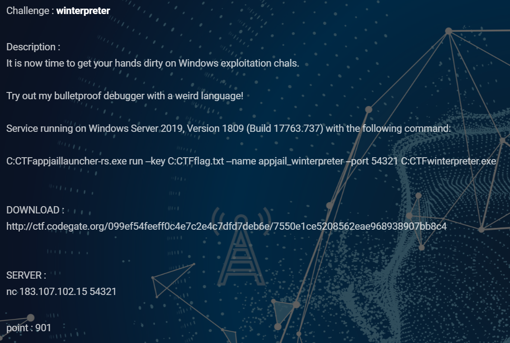
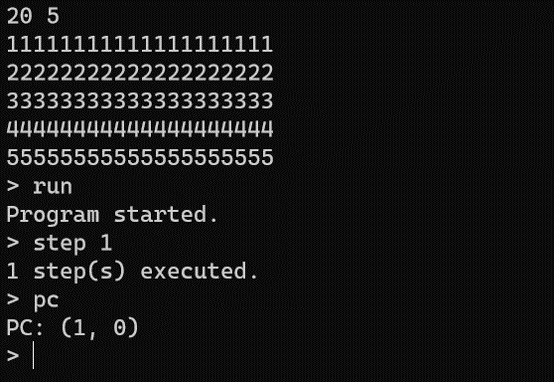
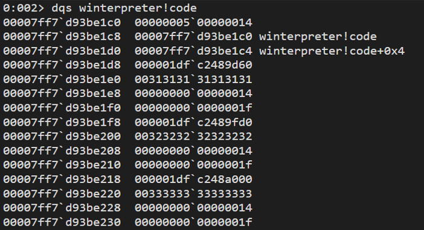
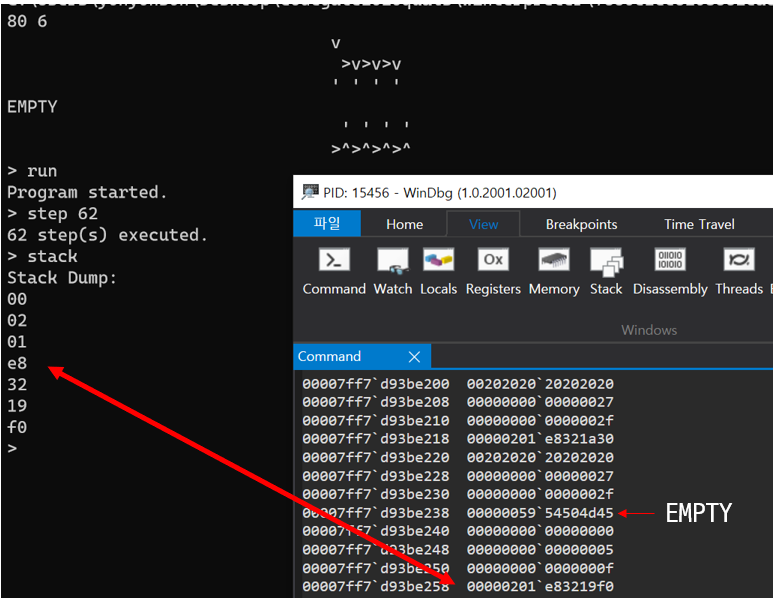
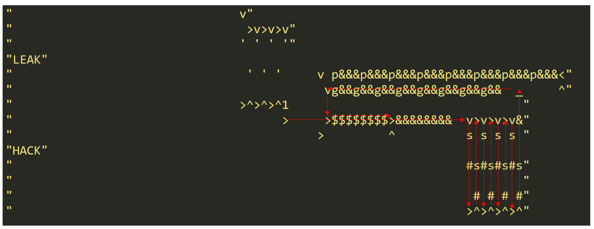
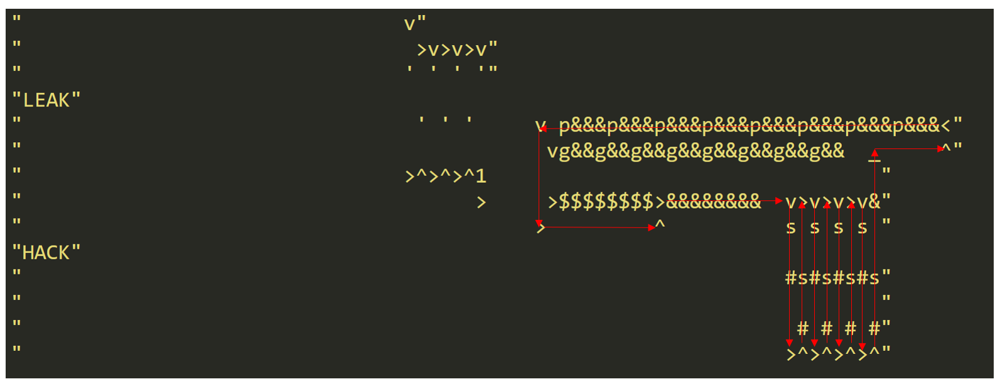
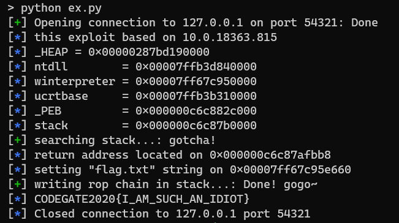

# winterpreter




## writeup

<details>
<summary>SPOILER ALERT!</summary>

문제파일을 실행하면 아래와 같이 입력한 명령어에 따라 opcode들을 해석해주는 interpreter가 동작하고 있다는 것을 알 수 있습니다.



문제설명에도 명시되어 있듯이 debugger의 stack dump나 step into같은 기능들이 구현되어 있으며, 실행을 할 때마다 PC( [program counter](https://en.wikipedia.org/wiki/Program_counter) )가 증가한다는 것을 확인할 수 있습니다. 

처음 입력을 받을땐 width( 가로길이, 최대 80 )와 height( 세로길이, 최대 25 )를 입력받고, 해당 크기만큼만 opcode를 입력받아 .data section에 보관합니다.



보관된 opcode들은 PC가 가리키는 순서대로 실행되게 되는데, 여기서 특이한 점이 opcode가 2차원 배열의 형태로 보관되어 있어 PC가 기존의 수직적인 메모리 구조에 따라 실행되는게 아니라 상하좌우로 움직인다는 점입니다. 이를 위해 PC도 아래와 같은 Coord 구조체 형식을 사용합니다.

```c
struct Coord {
    __int32 x;
    __int32 y;
    __int32 *x_ptr; // point address of self x
    __int32 *y_ptr; // point address of self y
}
```

처음 실행했을때는 기본값으로 x의 값을 1씩 증가시키며 opcode를 읽어들여 실행하지만 특정 opcode를 사용하면 이 방향을 바꿀 수 있으며, 처음 입력했던 width와 height의 범위를 벗어나는 위치는 가리킬 수 없습니다.

일단 **winterpreter!RunStep**에 정의된 opcode들을 정리한 내용은 아래와 같습니다.

```
winterpreter opcodes:

' '(0x20)
- 그냥 NOP

'!'(0x21)
- stack에서 pop한 값이 0이면 1을 push하고 아니면 0을 push함

'"'(0x22)
- 만약 cycle로 실행되고 있으면 다음 opcode로 '"'가 나올때까지 계속 실행함

'#'(0x23)
- 좌표( 혹은 PC )를 현재 방향으로 2번 옮기고 옮긴 위치에 있는 opcode를 해석함

'$'(0x24)
- stack에서 값 하나를 pop함

'&'(0x26)
- 숫자를 읽어들여 stack에 push함
( 입력값 범위 = 0 ~ 255 )

'\''(0x27)
- 다음 opcode를 stack에 push하고 그 다음 opcode로 넘어감

'*'(0x2a) '+'(0x2b) '-'(0x2d) '%'(0x25) '/'(0x2f)
- stack에서 값 2개를 pop한 뒤, 각각의 opcode에 맞는 사칙연산을 한 결과값을 stack에 push함
( '/', '%' 는 우항이 0일 경우 예외처리됨  )

','(0x2c)
- stack에서 pop한 값 1개를 화면에 출력함
ex)
입력값:
    111,,
출력값:
    \x01\x01
( hex format으로 출력한다는게 아니라 raw value로 출력한다는 뜻 )

'.'(0x2e)
- stack에서 pop한 숫자 1개를 공백이랑 같이 화면에 출력함 
ex)
입력값:
    111..
출력값:
    1 1

'0' ~ '9'(0x30 ~ 0x39) 'a' ~ 'f'(0x61 ~ 0x66)
- stack에 해당 hex값을 push함
( 0 = 0x00, a = 0x0a )

':'(0x3a)
- stack에서 pop한 값 1개를 2번 push함

'<'(0x3c) '>'(0x3e) '^'(0x5e) 'v'(0x76)
- PC의 현재 방향( 혹은 좌표 )를 다음 연산부터 opcode에 따라 상하좌우 중 하나로 변경 

'?'(0x3f)
- PC의 방향을 상하좌우 중에서 임의로 하나를 선택해 변경

'@'(0x40)
- 실행을 멈춤

'\'(0x5c)
- stack에서 값 2개를 pop한 뒤, 반대 순서로 push함

'_'(0x5f)
- stack에서 pop한 값이 0이면 PC의 방향을 '>'로 설정하고, 아니면, '<'로 설정함 

'|'(0x7c)
- stack에서 pop한 값이 0이면 PC의 방향을 '^'로 설정하고, 아니면, 'v'로 설정함 

'`'(0x60)
- stack에서 값 2개를 pop해 첫번째 값이 크면 0, 작으면 1을 push함

'g'(0x67)
- stack에서 값 2개를 pop한뒤 각각의 값을 순서대로 좌표의 x,y로 사용해 해당 좌표에 있는 값을 push함

'p'(0x70)
- stack에서 값 3개를 pop한뒤 처음 2개의 값을 순서대로 좌표의 x,y로 사용해 해당 좌표에 세번째 값을 삽입함

's'(0x73)
- PC를 현재 방향으로 한번 이동시킨 뒤, 해당 좌표에 stack에서 pop한 값 1개를 삽입함

'x'(0x78)
- 현재 PC가 가리키는 좌표에 stack에서 pop한 값 1개를 삽입함
```

opcode들의 기능들을 정리하고 나서 이제 취약점을 찾기 위해 각각의 구현체들을 살펴봤는데 딱히(?) 쓸만한 attack vector가 보이지 않았습니다. 제가 interpreter 문제들을 많이 풀어본 건 아니지만 대부분 특정조건하에 정해진 메모리 영역 너머에 접근가능한 Out-Of-Bound나 내부적으로 사용하는 변수 자료형을 잘못 설계해 발생하는 Type Counfusion 취약점을 내포하고 있다고 생각했는데, 최소한 제가 봤을땐 그런 취약점은 찾지 못했습니다.

그래서 interpreter 구현체 외적인 부분을 살펴보다 재밌는 걸 발견했습니다.


입력한 opcode들의 가로길이가 길어지면 Heap에 따로 메모리 공간을 할당해 보관하지만, 만약 길이가 8 이하로 짧다면 .data section의 **winterpreter!code** 영역에 값을 보관하게 됩니다. 그런데 이 경우, winterpreter 구현체의 모든 Out-Of-Bound 검사가 처음 입력한 width와 height 값을 기준으로 하고 있기 때문에 길이가 짧은 opcode x축을 이용하면 다른 opcode 구조체에 접근할 수 있는 Out-Of-Bound Access 취약점이 발생하게 됩니다.

```
80 6
                                v
                                 >v>v>v
                                ' ' ' '
EMPTY
                                 ' ' ' '
                                >^>^>^>^
```


이 취약점을 통해 leak한 주소값은 LFH가 활성화된 NT Heap 영역입니다.


이 주소값을 통해 해당 heap 영역의 _HEAP 구조체 주소를 구할 수 있고, 그 근처에 있는 ntdll 주소( **_HEAP->LockVariable->Lock**, offset 0x2c0 )를 leak한 뒤 ntdll안에 보관되어 있는 _PEB 구조체 주소( **ntdll!TlsBitMap+0x8** )를 구할 수 있다면 익스플로잇을 위해 필요한 모든 주소값을 구할 수 있습니다.

이제 위에서 분석한 opcode들과 발견한 취약점을 가지고 익스플로잇 코드를 작성해야 합니다.

opcode와 취약점을 엮는 작업은 프로그래밍과 비슷한 작업이어서 여러가지 방법이 있을 수 있겠으나 전 중간에 AAR( Arbitrary Address Read )와 AAW( Arbitrary Address Write ) primitive 중 하나를 선택할 수 있는 분기를 넣어두고 **quit** 명령어로 종료할 때 돌아갈 main() 함수의 return address 부분을 ROP chain으로 덮어씌웠습니다.

실제 코드를 어떤 식으로 짰는지는 [풀익스 코드](ex.py)를 참조하시고 전 opcode를 어떤 식으로 활용했는지 간단하게 설명해드리겠습니다.


위 부분은 앞서 설명한 취약점으로 Heap주소를 leak합니다.



AAR primitive를 구현한 부분입니다. 중간에 opcode '_'(0x5f) 로 분기를 만들어놨고, 임의의 주소를 11번째 opcode 줄에 쓰기 때문에 해당 x축을 실행하게 되면 유효하지 않은 opcode로 예외처리 될 수 있기 때문에 opcode '#'(0x23)로 2단점프(?)를 사용했습니다. 읽어들인 값을 stack에 보관하기 떄문에 값을 파싱하고 나선 opcode '$'(0x24)로 stack을 비워줘야 합니다.



AAW primitive를 구현한 부분입니다. 임의의 주소를 11번째 opcode 줄에 쓰는 건 AAR primitive와 같지만 opcode 'g'(0x67) 대신 opcode 'p'(0x70)를 사용해 값을 삽입한다는 차이만 있을 뿐입니다.


위에서 설명한 것처럼 각각의 opcode들이 어떤 역할을 하는지 파악하는게 번거로울 뿐, 취약점까지 찾고 나면 이를 코드로 구현하는 것은 그다지 어렵지 않습니다.

opcode를 활용하는 부분은 앞서 마치 프로그래밍 같다, 라고 말했지만 그보단 추억의 [RPG Maker](https://ko.wikipedia.org/wiki/RPG_%EB%A7%8C%EB%93%A4%EA%B8%B0)같은 게임 맵 개발도구로 각각 서로다른 상호작용을 하는 객체들을 적재적소에 배치하는 듯한 느낌에 더 가까웠던 것 같습니다.


</details>